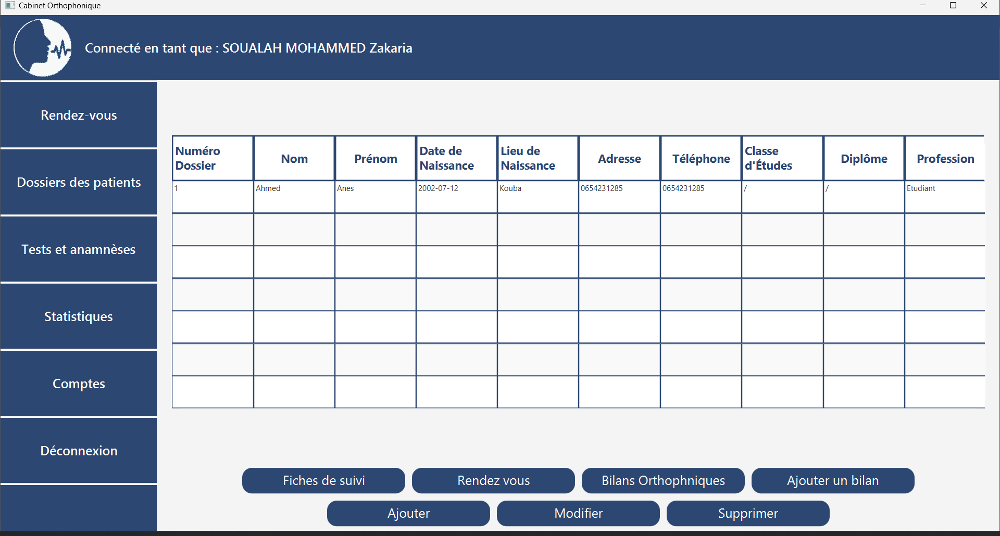

## Overview
The Therapy-Cabinet-Management-System is a comprehensive solution designed to streamline the operations of therapy practices. This system allows users to efficiently manage appointments, maintain detailed patient profiles, and handle user accounts with ease. It also provides robust statistical analysis to monitor practice performance and patient progress. Additionally, the system includes functionality for administering and tracking various tests for patients, ensuring a holistic approach to patient care and management.

## Demonstration

## Contributing

Contributions are welcome! Please fork the repository and submit a pull request with your changes. Ensure your code follows the project's coding standards and includes appropriate tests.

## License

This project is licensed under the MIT License. See the [LICENSE](LICENSE) file for details.